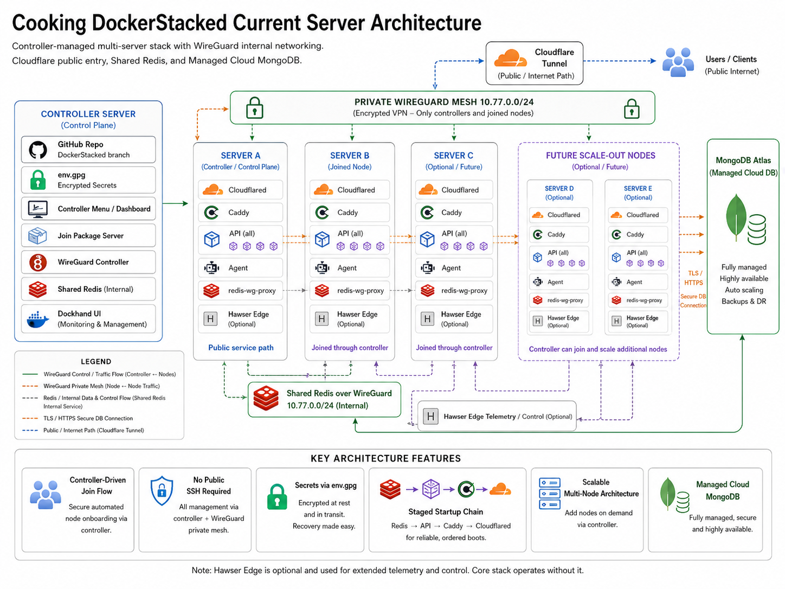

# Cooking DockerStacked V70 — Server Design Overview

## Overview

Cooking DockerStacked V70 is designed as a controller-managed, multi-server application stack built for secure operations, reliable deployment, and future scale-out.

The system separates public application traffic from private server control traffic. Public users reach the application through Cloudflare Tunnel, while server management, internal coordination, and node-to-node control run through a private WireGuard network.

This design allows new servers to be joined, configured, monitored, and scaled without exposing normal server administration services to the public internet.

---

<p align="center">
  
</p>

## Design Goals

The V70 server design focuses on five core goals:

1. **Secure public access** — users reach the application through Cloudflare, not exposed server ports.
2. **Private server management** — controller-to-server management happens over a private WireGuard mesh.
3. **Repeatable server joins** — new servers can be added through a controller-issued join flow.
4. **Reliable container startup** — services start in the correct order so the API is healthy before public routing starts.
5. **Scale-out readiness** — additional servers can be added as the platform grows.

---

## High-Level Architecture

The stack is made up of these main layers:

```text
Public users
  ↓
Cloudflare Tunnel
  ↓
Server cloudflared container
  ↓
Caddy reverse proxy
  ↓
Cooking API containers
  ↓
MongoDB Atlas managed cloud database
```

Private controller and server operations run separately:

```text
Controller server
  ↓
Private WireGuard mesh
  ↓
Joined servers
  ↓
Agents, Redis proxy, monitoring, control commands
```

This separation means the public application path and the private management path are not the same network.

---

## Public Application Path

Public traffic enters through Cloudflare Tunnel.

Cloudflare handles the external public entry point, while each active application server runs its own `cloudflared` container. The tunnel forwards public application traffic into the local server stack.

Inside each server, traffic flows through:

```text
cloudflared → Caddy → API container(s)
```

### Cloudflared

`cloudflared` creates the outbound connection from the server to Cloudflare. This avoids needing to expose normal public web ports directly from the server.

### Caddy

Caddy acts as the internal reverse proxy. It routes traffic to the API containers and only starts after the API is confirmed healthy.

### API Containers

The API layer handles the Cooking application backend. V70 supports one or more API replicas per server, allowing traffic capacity to increase as servers are scaled.

---

## Private WireGuard Management Mesh

The private WireGuard mesh is used for internal server management and coordination.

It is used for:

- Controller-to-server management.
- Joined server registration.
- Agent communication.
- Internal command dispatch.
- Shared Redis access through the Redis WireGuard proxy.
- Secure private automation between the controller and joined nodes.

WireGuard uses public/private key pairs for peer authentication. It does not rely on public passwords or public administration panels.

The important point is this:

```text
Cloudflare is for public application access.
WireGuard is for private control and internal server coordination.
```

They run alongside each other, but they do different jobs.

---

## Controller Server

The controller server is the command and management point for the stack.

It handles:

- The controller menu and dashboard.
- Join package creation.
- WireGuard peer management.
- Server registration.
- Encrypted secret bundle delivery.
- Shared Redis coordination.
- Monitoring and management through Dockhand and internal agents.
- Future node onboarding.

The controller does not publicly expose application secrets. It prepares encrypted bundles for joining servers and sends only what that server needs.

---

## Joined Server Flow

New servers are added through a controller-managed join process.

At a high level:

1. The controller issues a short-lived join code.
2. The joining server pulls the join package from the temporary join server.
3. The joining server generates its own keys.
4. The controller approves the node and adds its private WireGuard peer.
5. The controller returns an encrypted server bundle.
6. The joining server writes Docker secret files locally.
7. The Docker stack starts using the staged startup process.
8. The server reports back through its agent.

This avoids manually copying raw secrets between servers.

---

## Docker Stack on Each Server

Each application server runs a Docker-based stack.

A typical joined node includes:

| Component | Purpose |
|---|---|
| `cloudflared` | Public Cloudflare Tunnel connector. |
| `caddy` | Internal reverse proxy for the API. |
| `api` | Cooking backend API container or replicas. |
| `agent` | Controller-managed node agent. |
| `redis-wg-proxy` | Internal Redis access over the private WireGuard path. |
| `Hawser Edge` | Optional monitoring/control edge component. |

This keeps each node self-contained while still allowing the controller to manage it centrally.

---

## Staged Startup System

V70 uses a staged startup sequence so public traffic is only enabled after the required internal services are ready.

The intended startup order is:

```text
Redis WireGuard proxy
  ↓
Agent
  ↓
API container(s)
  ↓
Caddy
  ↓
Cloudflared
```

This is important because it prevents Cloudflare from routing traffic to a server before the API and Caddy are ready.

The API startup was also hardened so Redis/cache connection problems do not block the API listener from starting. This improves recovery and prevents a Redis issue from making the API completely unavailable.

---

## Shared Redis

Shared Redis is used for internal coordination and runtime state.

Joined servers access Redis through the private WireGuard path rather than through a public Redis endpoint.

This means Redis is treated as an internal service, not a public internet service.

---

## MongoDB Atlas Managed Cloud Database

The database layer uses MongoDB Atlas as a managed cloud database.

The application API connects securely to MongoDB Atlas using the configured database connection string. MongoDB Atlas provides the managed database layer, including cloud-hosted availability features, backups, and operational management.

MongoDB Atlas is separate from the WireGuard mesh. It is a managed external database service accessed securely by the API layer.

---

## Secrets and Environment Handling

The V70 design avoids exposing raw secrets publicly.

Secrets are handled through:

- Encrypted uploaded environment files.
- Controller-side secret import.
- Encrypted server-specific bundles.
- Local Docker secret files on each server.
- Locked-down file permissions.

Raw `.env` content is not served publicly by the join server.

The join process sends an encrypted bundle prepared for the joining server rather than simply exposing plain secrets.

---

## Security Model

The security model is based on separation of duties.

### Public-facing layer

Public users only interact with the application through Cloudflare Tunnel.

The public path is:

```text
User → Cloudflare → cloudflared → Caddy → API
```

### Private management layer

Management and automation happen through the private WireGuard network.

The private path is:

```text
Controller → WireGuard → joined server agent / dndops / Redis proxy
```

### Not exposed publicly

The design avoids publicly exposing:

- SSH administration.
- Redis.
- MongoDB.
- Docker socket.
- Controller command interfaces.
- Agent command interfaces.
- Raw environment files.
- Docker secret files.

---

## Scaling Model

The platform can scale in two ways.

### Scale within a server

A server can run multiple API replicas behind Caddy.

This allows more API capacity on the same machine when resources allow it.

### Scale across servers

Additional servers can be joined through the controller join flow.

A future scale-out design may include:

```text
Server A
Server B
Server C
Server D
Server E
Server F...
```

Each node can run the same core stack:

```text
cloudflared
Caddy
API replicas
Agent
redis-wg-proxy
optional Hawser Edge
```

This allows the system to expand horizontally as traffic or operational needs increase.

---

## Monitoring and Management

The controller can monitor joined servers through the internal agent system.

Monitoring can include:

- Node online/offline status.
- API replica count.
- Healthy API container count.
- Redis status.
- Cloudflared status.
- System load.
- Memory usage.
- Disk usage.
- Recent command status.

Dockhand and Hawser Edge are used as optional monitoring and management components for deeper operational visibility.

---

## Cemented V70 Features

V70 cements the following system features:

- Controller-driven server joining.
- Docker-based joined node stack.
- Private WireGuard management network.
- No public SSH requirement for normal controller management.
- Secure server-specific bundle delivery.
- Docker secret file generation on joined servers.
- Shared Redis over the private internal path.
- MongoDB Atlas managed cloud database support.
- Staged service startup for reliable booting.
- Cloudflare Tunnel public entry.
- Multi-node scale-out design.
- Monitoring and controller-managed server visibility.

---

## Public Summary

Cooking DockerStacked V70 is built as a secure, controller-managed, scalable server architecture.

Public users access the application through Cloudflare Tunnel. Internal server management happens through a private WireGuard mesh. Application servers run a Docker stack with Cloudflared, Caddy, API containers, a control agent, and internal Redis access. MongoDB Atlas provides the managed cloud database layer.

The system is designed so new servers can be joined and scaled from the controller without exposing normal administration services to the public internet.

This gives Cooking a stronger foundation for secure deployment, reliable operations, and future multi-server growth.
